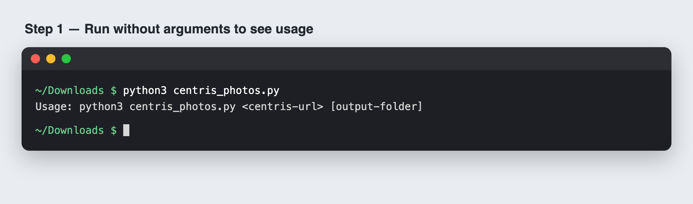
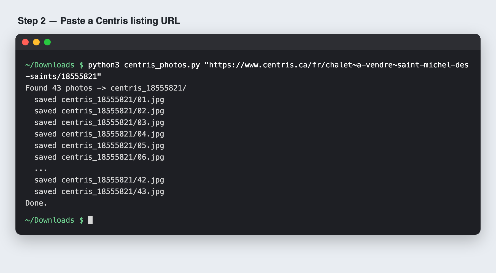
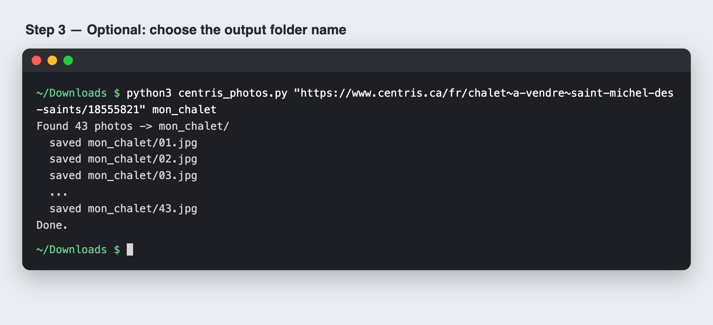
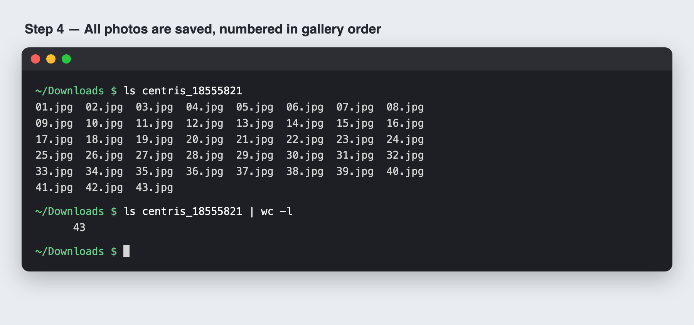

# centris-photos

A small command-line tool that downloads every photo from a [Centris.ca](https://www.centris.ca) listing into a folder.

- No dependencies: uses only Python 3 and `curl` (both preinstalled on macOS)
- Photos are saved at full size (1260 px wide), uncropped, and numbered in gallery order

## Usage

```bash
python3 centris_photos.py <centris-listing-url> [output-folder]
```

### 1. Run without arguments to see usage


### 2. Paste a Centris listing URL
Photos go into `centris_<listing number>/` by default.



### 3. Optional: choose the output folder


### 4. Done — all photos saved, in gallery order


## Notes

The tool reads the photo list from the listing page's HTML. If Centris changes its site, it may stop finding photos. Listing photos are copyrighted by their owners, so use the downloads for personal reference only.
